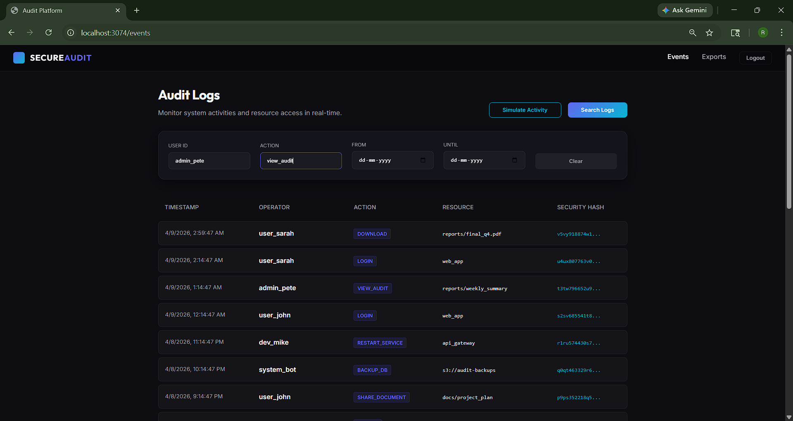
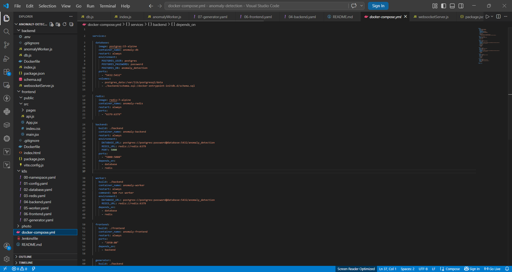
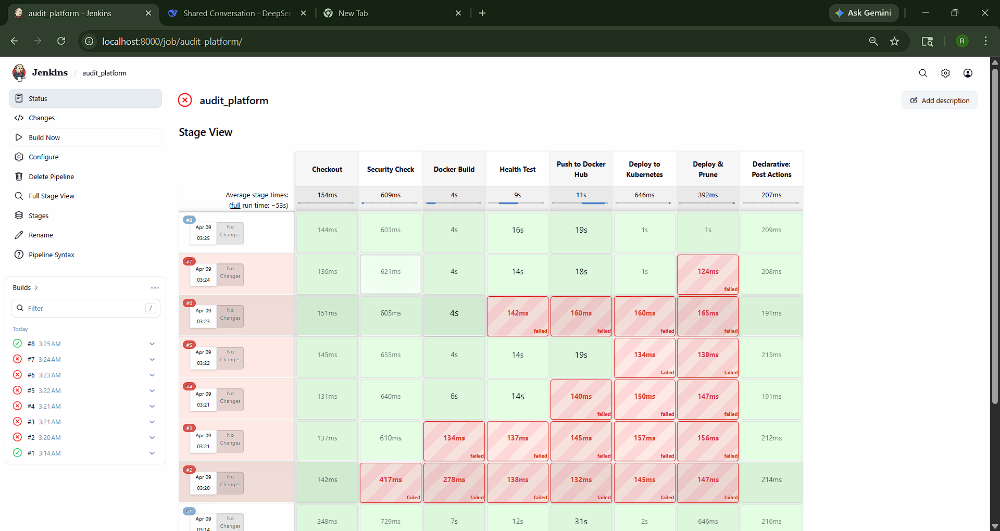
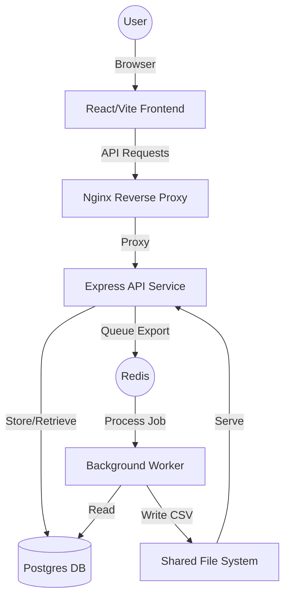

# 🛡️ SecureAudit Platform

A high-performance, multi-tenant audit logging platform featuring **cryptographically chained, tamper-evident logs** and background data exporting.

## 🚀 Overview

SecureAudit helps organizations track every action within their infrastructure. By using SHA-256 hash chains, we guarantee that once a log is written, it cannot be modified without breaking the security chain of all subsequent logs.

### Key Features:
- **Immutable Logs**: Each event is hashed with the previous event's hash.
- **Multi-Tenant**: Securely isolated logs for different organizations/tenants.
- **Asynchronous Exports**: Large history exports are handled via background workers (Redis/Bull).
- **Premium Dashboard**: A modern, glassmorphic UI built with React and Vite.
- **Production-Ready**: Integrated security headers, rate limiting, and centralized error handling.

## 📸 Screenshots & Visual Assets

Visual overview of the application and deployment environment:

<div align="center">
  
  <p><em>Application Dashboard</em></p>
</div>

<div align="center">
  
  <p><em>Docker Compose Environment</em></p>
</div>

<div align="center">
  
  <p><em>Jenkins CI/CD Dashboard</em></p>
</div>

*(More screenshots are available in the `photo/` directory.)*

## 🏗️ Architecture Flow



## 🚦 Quick Start (Docker)

### 1. Launch:
```powershell
docker-compose up --build -d
```

### 2. Access:
Navigate to [http://localhost:3074](http://localhost:3074).
**Demo API Key**: `test-api-key-123`

## 🚢 Kubernetes Deployment

The platform is fully container-orchestrated for Kubernetes. All manifests are located in the `/kubernetes` directory.

### Quick Deploy:
1.  **Tag your images**:
    ```powershell
    docker tag audit-backend:latest audit-backend:latest
    docker tag audit-frontend:latest audit-frontend:latest
    ```
2.  **Apply manifests**:
    ```powershell
    kubectl apply -f kubernetes/
    ```
3.  **Monitor**:
    ```powershell
    kubectl get pods -n audit-platform -w
    ```
4.  **Access**:
    Get the frontend service URL:
    ```powershell
    kubectl get svc audit-frontend -n audit-platform
    ```

## ⚙️ CI/CD Pipeline (Jenkins)

The project includes an automated end-to-end Jenkins CI/CD pipeline (`Jenkinsfile`), managing:
- **Security Check**: Scans for sensitive files (e.g., `.env`) before building.
- **Docker Build**: Builds configured images via `docker-compose.yml`.
- **Health Test**: Ensures backend containers are fully healthy before proceeding.
- **Docker Hub Push**: Automatically tags and pushes images to Docker registry (`rajbirari9737/audit-platform-*`).
- **Kubernetes Deployment**: Dynamically applies Kubernetes manifests to the cluster (`docker-desktop`), ensuring automated rollouts.
- **Prune**: Cleans up detached/old docker images automatically.

## 🔒 Security Mechanism

Each audit event record contains a `hash` and a `previous_hash`.
The `hash` is calculated as:
`hash = SHA256(previous_hash + tenant_id + user_id + action + resource + metadata + timestamp)`

If an attacker modifies a record in the database, the `previous_hash` of the *next* record will no longer match the recalculated hash of the modified record, immediately flagging the system as compromised.
